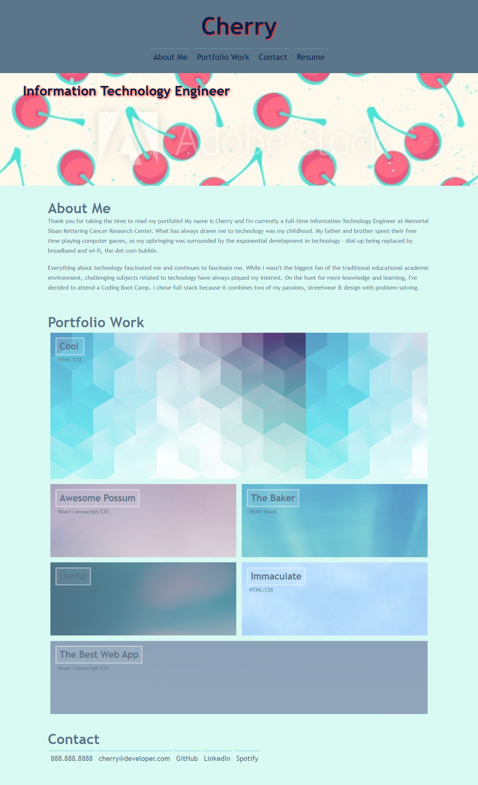

# Portfolio
Professional Portfolio

## Purpose of the Assignment

The purpose of the assignment was to create a professional work portfolio showcasing the work I've done as a web developer. 

## Deployment
Application Link: https://c1am.github.io/portfolio/

## Header and Nav

The header highlights my name and the navigation bar contains four sections essential to a professional portfolio. Each of the navigation links to the corresponding section on the page. I did not feel comfortable uploading a link to my resume just yet, so I didn't attach it, but the link template is ready in the code to be referrenced. I also didn't feel comfortable adding a photo of myself, so there is a placeholder image of the updated picture.

## Portfolio Web Applications

Since I haven't created any live applications yet, I wasn't able to link them, but the link template in the index.html file are ready to be filled in with future links and the names are ready to be changed as well.

## Contact
GitHub, LinkedIn, and Spotify links will open up in a new tab. GibHub is linked to my actual GitHub page, but I did not feel comfortable including the actual links of the other pages just yet.

## Application Screenshots

The following shows a screenshot of the professional portfolio webpage:

